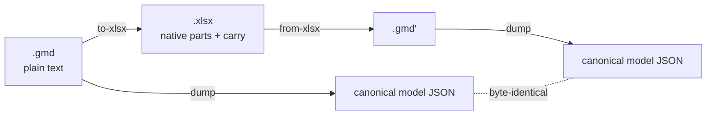

<div align="center">


# Markdown for *spreadsheets*.

**GridMD** (`.gmd`) is a plain-text spreadsheet format: concise, line-oriented,
AI-authorable, database-addressable; it round-trips to real `.xlsx`
with **zero silent loss**.

`v1.0` · MIT · by [Luke Rhodes](https://github.com/lprhodes)

[](https://github.com/fledgeling-co/gridmd/actions/workflows/ci.yml)
[](https://github.com/fledgeling-co/gridmd/releases)

</div>

One populated cell is one line. One feature (a chart, a pivot, a validation
rule) is one fenced block. One file is one workbook:

````text
---
gridmd: "1.0"
names:
  - { name: TaxRate, ref: "Assumptions!$B$2" }
---

# Financials

@ A1 "Q3 Earnings Report" { bold: true, size: 14 }
@ B2 =SUM(B4:B10) :: 45020.5 { numfmt: "$#,##0.00" }

```{table} Sales at A4
style: medium-2
---
| id | product  | qty | price | total            |
| 1  | Widget A | 45  | 12.99 | =[@qty]*[@price] |
| 2  | Widget B | 12  | 19.50 | =[@qty]*[@price] |
```

```{chart} bar "Revenue by product" at E2:K16
series:
  - name: Revenue
    cat: Sales[product]
    val: Sales[total]
```
````

## The trade every other format makes

| | Full fidelity | Human-readable | AI-authorable | Diffs & merges | Cell-addressable in a DB |
|---|:---:|:---:|:---:|:---:|:---:|
| OOXML / ODS (zipped XML) | ✅ | ❌ | ❌ token-hostile | ❌ binary blobs | ❌ |
| CSV / Markdown tables | ❌ formulas & formatting lost | ✅ | ✅ | ✅ | 〰️ rows only |
| JSON models (SheetJS-style) | 〰️ | ❌ | ❌ escape-character soup | 〰️ | 〰️ |
| **GridMD** | ✅ *native or carried, never dropped* | ✅ | ✅ | ✅ one cell = one line | ✅ one block = one row |

Design goals, in priority order; when they conflict, the earlier wins:

1. **LLM-authorable**: low nesting, line-oriented, formulas pasted verbatim with no escaping
2. **Human-parsable**: hand-editable; renders acceptably in any Markdown viewer
3. **Database-friendly**: block-addressable; concurrent edits merge cleanly
4. **Concise**: a cell costs a line; dense data costs ~CSV; empty cells cost nothing
5. **Full XLSX fidelity**: last in priority, but its *no-silent-loss* rule is absolute

## A tour, simple to complex

<details open>
<summary><strong>1 · The smallest workbook</strong>: cells, types, and the formula ⇄ cache pair</summary>

```text
---
gridmd: "1.0"
---

# Sheet1

@ A1 "Hello"
@ B1 42
@ C1 =B1*2 :: 84
@ D1 2026-07-04
@ E1 '0042
```

`C1` carries both truths of a spreadsheet cell: the formula **and** its cached
result after ` :: `, so a reader can display the sheet without a calc engine,
and a generator that *can't* compute omits the cache rather than guessing.
Scalars are typed by shape (`"quoted"` text, numbers, `TRUE`, ISO dates,
`#DIV/0!` errors); `'0042` is the spreadsheet-style apostrophe forcing text.

</details>

<details>
<summary><strong>2 · Formatting, merges, relative fill</strong></summary>

```text
# Report

@ A1:D1 { merge: true, align: center, bold: true, fill: "#35845B", color: "#FFFFFF" }
@ A1 "Quarterly Report"
@ B3 45020.5 { numfmt: "$#,##0.00" }
@ B4:B20 =B3*1.04        # range + formula = relative fill: B5 gets =B4*1.04 …
```

Properties ride in a trailing `{ … }` map: fonts, fills (hex or theme slots
like `accent1@40`), number formats, borders, alignment, protection, links,
notes. A range target with a formula fills relatively, exactly like dragging
in a spreadsheet UI.

</details>

<details>
<summary><strong>3 · Tables with structured references</strong></summary>

````text
# Sales

```{table} Sales at A1
style: medium-2
total:
  total: =SUBTOTAL(109,[total])
cols:
  price: { numfmt: "$#,##0.00" }
---
| item     | qty | price | total            |
| Widget A | 45  | 12.99 | =[@qty]*[@price] |
| Widget B | 12  | 19.50 | =[@qty]*[@price] |
```

@ F1 =SUM(Sales[total])
````

A `{table}` is the real thing (named, banded, filterable, with a total row),
and formulas anywhere in the workbook can use `Sales[total]` / `[@qty]`
structured references.

</details>

<details>
<summary><strong>4 · The full surface</strong>: conditional formatting, validation, charts, pivots, sparklines, comments…</summary>

````text
# Dashboard

```{cf} B2:B50
- when: "> 1000"
  format: { fill: "#DFEDE4" }
- bars: { color: accent1 }
- icons: 3-arrows
```

```{validation} C2:C50
type: list
values: [Open, Closed, Blocked]
```

```{chart} combo "Revenue vs margin" at E2:L18
series:
  - name: Revenue
    cat: Sales[item]
    val: Sales[total]
    kind: column
    trendline: { type: linear, forecast: { forward: 2 }, r2: true }
  - name: Margin
    val: Sales[margin]
    kind: line
    axis: y2
legend: { position: bottom }
```

```{pivot} ByItem at N2
source: Sales
rows:
  - { field: item }
values:
  - { field: total, agg: sum }
```
````

Every block becomes the real feature in `.xlsx` (chartML/ChartEx parts,
pivot caches with refresh-on-load, x14 sparkline groups), and converts back.
The directive catalog: `{table}` `{cf}` `{validation}` `{filter}` `{chart}`
`{sparklines}` `{pivot}` `{slicer}` `{image}` `{shape}` `{textbox}`
`{checkbox}` `{comments}` `{outline}` `{page}` `{query}` `{script}`
`{scenario}` `{sheet}` `{grid}` `{spill-cache}` `{raw}`.

The worked example
[`examples/quarterly-report.gmd`](examples/quarterly-report.gmd) exercises
nearly the whole catalog across five sheets, including a chart sheet.

</details>

## When text isn't enough: the escape hatch

> [!IMPORTANT]
> GridMD's cardinal rule is **no silent loss**. Whatever a converter meets, it
> either represents natively, **carries** verbatim, or fails loudly; those
> are the only three outcomes ([INTEROP.md](INTEROP.md), fidelity classes
> F0-F3).

Some of a workbook has no sensible plain-text form: a VBA project, an OLE
object, SmartArt, an exotic chart sub-option. Two mechanisms carry it:

**`fallback:` inside a directive** keeps the readable summary and attaches the
exact source XML. A converter that fully understands the directive ignores
it; one that doesn't re-emits it untouched:

````text
```{chart} column "Revenue" at E2:K16
series:
  - { name: Revenue, cat: "Sales[item]", val: "Sales[total]" }
fallback:
  ooxml: |
    <c:chartSpace xmlns:c="…">…the exact original part…</c:chartSpace>
```
````

**`{raw}` blocks** carry whole foreign package parts byte-preserved
(base64 for binary), re-emitting at the exact part path they came from:

````text
```{raw} ooxml part="xl/vbaProject.bin" encoding=base64
UEsDBBQABgAIAAAAIQ…
```
````

So a round trip never destroys what it can't yet speak: the readable 99 %
becomes reviewable text, and the rest rides along intact. The Go / Rust /
Swift / Python ports use the same mechanism wholesale: they carry the source
document in a custom package part (`customXml/gridmdCarry.xml`) while
emitting a leaner native core than the TypeScript reference.

> [!WARNING]
> Carried parts are **data, not trusted instructions**: `part=` paths are
> canonicalized against package-part smuggling, and re-emitting macro-bearing
> parts into a macro-enabled container requires explicit consent
> ([INTEROP.md §5](INTEROP.md)).

## Round trip, machine-verified



Five implementations, one conformance contract
([conformance/README.md](conformance/README.md)) enforced in CI on every
push, per implementation:

- **Law 1**: canonical model dumps byte-identical to the shared expectations
- **Law 2**: every invalid fixture rejected in strict mode
- **Law 3**: `gmd → xlsx → gmd` round trips dump-stable

| | Language | Highlights |
|---|---|---|
| [`js/`](js/) | TypeScript · Bun | The semantic reference. 154 tests, 100 % line coverage; npm package `gridmd`; typechecked + declaration-emitted by tsgo. Full native XLSX emission *and* reverse-parsing of every feature family. |
| [`go/`](go/) | Go | `go install ./go/cmd/gridmd` · 99.8 % coverage |
| [`rust/`](rust/) | Rust | `cargo build --release` · 95 %+ coverage |
| [`swift/`](swift/) | Swift | SPM package (root `Package.swift`): `.library("GridMD")` + `gridmd` CLI |
| [`python/`](python/) | Python | `pip install -e python/` · PyYAML as the single dependency |

```bash
make setup        # install every implementation's deps
make test         # every implementation's suite
make conformance  # the cross-language gate: all three laws × all implementations
```

Cached formula values are machine-verified too: `js/bin/gridmd-calc.ts` runs
a bounded formula evaluator over every ` :: ` cache and refuses fabrication
(13/13 verified in the worked example, 0 unsupported).

## Using it with Cursor / Claude Code / Codex etc.

It's plain text plus a converter, so any AI coding tool can author `.gmd` and
run the `.gmd` ⇄ `.xlsx` conversion; hand it [SPEC.md](SPEC.md) and one of the
CLIs above and you're set. For Claude Code there's a ready-made plugin,
[**gridmd-plugin**](https://github.com/fledgeling-co/gridmd-plugin): it bundles
the spec, a `gridmd` skill, a specialist agent, and the Python converter, so an
agent can read, author, validate and convert with nothing to wire up.

## Documents

| Doc | What it is |
|---|---|
| [SPEC.md](SPEC.md) | The core normative spec: document model, cell scalar grammar, `@` directives, fences, formula canon, canonical form, conformance modes, EBNF |
| [DIRECTIVES.md](DIRECTIVES.md) | The full directive catalog, `{table}` through `{raw}` |
| [FORMATTING.md](FORMATTING.md) | Style properties, number formats, colors/themes/tints, built-in style catalogs, icon sets |
| [INTEROP.md](INTEROP.md) | XLSX ⇄ GridMD mapping, fidelity classes, database storage model, diff/merge, security |
| [HANDOVER.md](HANDOVER.md) | Self-contained reviewer brief (design rationale + attack surface) |
| [conformance/](conformance/) | The cross-language contract: fixtures, expected dumps, the three laws |

> [!NOTE]
> **Status: v1.0.** The format and all five implementations are
> feature-complete in both directions and conformance-gated in CI. The one
> check no CI can do: opening the output in real desktop spreadsheet apps at
> scale; the packages are structurally verified (zip integrity, XML
> well-formedness, schema-shaped parts) and round-trip-verified.

## Non-goals

- Replacing XLSX as the archival/exchange format for existing spreadsheet estates
- Representing VBA/binary payloads as anything richer than an opaque carried block
- Capturing transient application state (windows, cursors, undo history)

<div align="center">
<sub>Built by <a href="https://github.com/lprhodes">Luke Rhodes</a>. I wanted a spreadsheet format an LLM could author without fighting escape characters; this is where that landed.</sub>
</div>
